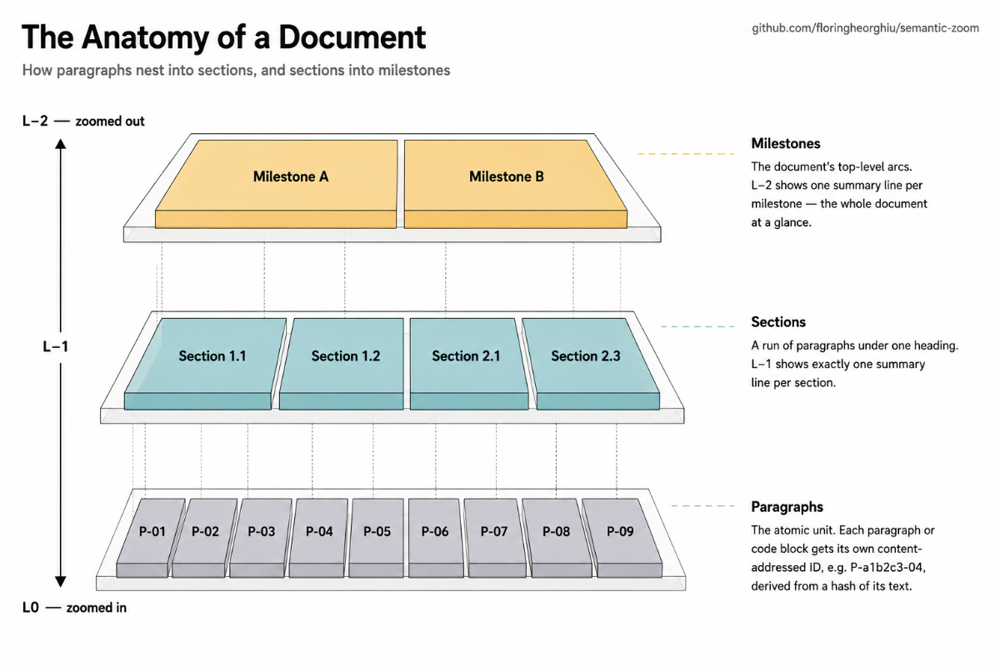
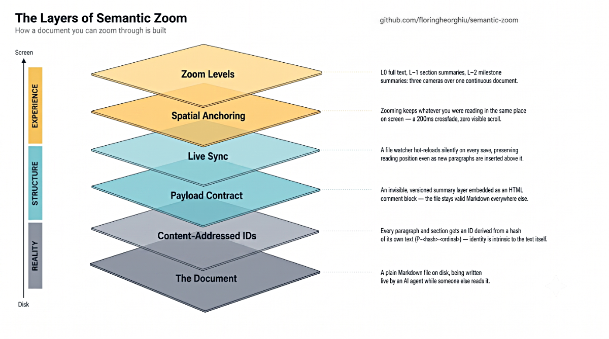

# Semantic Zoom

A native macOS reader for AI-generated Markdown that lets you **zoom through a document semantically** — from a bird's-eye milestone view, to section summaries, to the full text — without ever losing your place.

## Why this app

AI agents produce long, dense Markdown: implementation plans, research reports, specs. Reading them in a normal editor forces a bad trade — either you scroll through everything linearly, or you collapse headings and lose the thread. Neither matches how people actually read these documents: constantly moving between *"where am I in the big picture?"* and *"what exactly does this part say?"*

Semantic Zoom treats that movement as the primary interaction. A document has three **zoom levels**:

| Level | What you see |
|-------|--------------|
| **L0** | The full document — every paragraph, every code block |
| **L−1** | One summary line per section |
| **L−2** | One summary line per milestone (the document's top-level arcs) |



*Paragraphs nest into sections, and sections into milestones. Zooming out replaces a whole level with one summary line each; every unit carries a content-addressed ID so your place survives the change.*

Zooming is **spatially anchored**: whatever you were reading stays put. Zoom out from a paragraph and you land on *its* section's summary line, in the same place on screen; zoom back in and you return to the same paragraph. The transition is a 200 ms crossfade with zero visible scroll motion — the document re-composes around your attention instead of throwing you back to the top.

Because the intended author of these documents is an AI agent, the app is also built for **live reading while the document is being written**: it watches the file on disk and hot-reloads silently on every save, keeping your reading position pinned to the same *content* even when paragraphs are inserted above it.

### How it knows the structure

The summaries aren't generated by the app — they're carried **inside the Markdown file** as an invisible, versioned payload (an HTML comment block, so the file stays perfectly valid Markdown everywhere else). An agent writing a plan embeds the payload as it writes; the format is specified in [`docs/payload-format.md`](docs/payload-format.md). Every paragraph and section gets a **content-addressed ID** (derived from a hash of its own text), which is what makes reading-position survival across edits possible — and lets the app detect payloads that lie about their content.



*The full stack, from disk to screen — a plain Markdown file on disk, made zoomable by content-addressed IDs and the embedded payload, then hot-reloaded and spatially anchored under the three zoom levels you actually interact with.*

Files *without* a payload still open and read normally at L0. For those, the app can **generate the payload for you** from a local or remote model — see [Generating zoom layers](#generating-zoom-layers) below.

## How to use

### Install

1. Go to the [**Releases** page](https://github.com/floringheorghiu/semantic-zoom/releases) and download the latest `.dmg` under **Assets**.
2. Open it and drag **semantic-zoom** into **Applications**.
3. **First launch only:** the app isn't signed with an Apple developer certificate, so macOS blocks a plain double-click. Right-click the app → **Open** → **Open**. If macOS claims the app "is damaged", run `xattr -cr /Applications/semantic-zoom.app` in Terminal once, then open normally.

Requires an Apple Silicon Mac (M1 or newer).

### Reading

- **⌘O** — open a Markdown file (the empty-state screen also lists your recent files — one click to reopen)
- **Zoom control** (bottom of the window) — drag between the three levels, or jump straight with **⌘1** (full text, L0), **⌘2** (sections, L−1), **⌘3** (milestones, L−2); **[** / **]** step one level out / in
- **⌘↓ / ⌘↑** — step to the next / previous item at the current level, aligned to the top of the window; **⌘⇧↓ / ⌘⇧↑** jump to the end / top
- **Content map** (right edge) — a miniature of the document's sections; the accent highlight tracks where you are, and clicking a bar jumps there
- **⌘+ / ⌘− / ⌘0** — make the text larger / smaller / standard size, independently of the zoom levels
- **Code blocks** show at a fixed peek height with a chevron to expand the full block; **Mermaid flowcharts render inline**
- A **status pill** (top corner) names the document's state — *Native*, *Untagged*, or a warning for a damaged payload — and flashes brief messages on reload or generation
- **⌘W** — close the document · **⌘,** — settings · **⌘/** — the built-in help (itself a live, zoomable manual you can experiment on)

Leave the file open in your editor or let your agent keep writing it — the view updates on every save without stealing your scroll position.

Try it immediately: the repo ships tagged sample documents in [`fixtures/`](fixtures/) (`zoom_test.md`, `mock-a.md`, `mock-b.md`).

### Generating zoom layers

Opened a plain Markdown file with no payload? Click **Generate summary** and the app asks a language model to write the section and milestone summaries, then tucks them into the file as the invisible payload — your own text is never altered, and other Markdown apps ignore the block entirely. You choose where generation runs:

- **Local** — [Ollama](https://ollama.com) or any OpenAI-compatible server on your machine (e.g. llama.cpp). Nothing ever leaves your Mac.
- **Remote** — a hosted provider (Cerebras, Xiaomi, OpenRouter, …) with your own API key, stored in the macOS Keychain, never in a file.

The Generate button's tooltip always states exactly where the text would go before you commit, and a run can be cancelled mid-flight. When it finishes, all three zoom levels unlock on the spot. Configure the engine, provider, accent/theme, and prompt template in **Settings (⌘,)** — the same window also checks for and installs app updates.

## How to set up (development)

Three toolchains, then two commands.

```sh
# one-time
xcode-select --install                                            # Apple build tools
curl --proto '=https' --tlsv1.2 -sSf https://sh.rustup.rs | sh    # Rust (the app's backend)
# install Node.js ≥ 20 from https://nodejs.org, then open a fresh terminal

git clone https://github.com/floringheorghiu/semantic-zoom.git
cd semantic-zoom
npm install
```

| Command | What it does |
|---------|--------------|
| `npm run tauri dev` | Run the app in dev mode — live window, auto-reloads on code changes. First launch compiles the Rust side (a few minutes); after that, seconds. |
| `npm run dmg` | Build the installable `.dmg` → `src-tauri/target/release/bundle/dmg/` |
| `npm run ci` | Lint + full Rust and TypeScript test suites |

Plain `npm run dev` starts only the web layer in a browser — not useful here, since file loading lives in the Rust side. Use `npm run tauri dev`.

Architecture ground rules live in [`CLAUDE.md`](CLAUDE.md); the full design is in [`docs/Implementation_Plan.md`](docs/Implementation_Plan.md). The short version: **Rust owns disk truth, TypeScript owns view truth**, and they meet at exactly three crossings (`load_document`, `watch_directory`, the `doc://changed` event). Publishing a new build is documented in [`docs/packaging.md`](docs/packaging.md).
