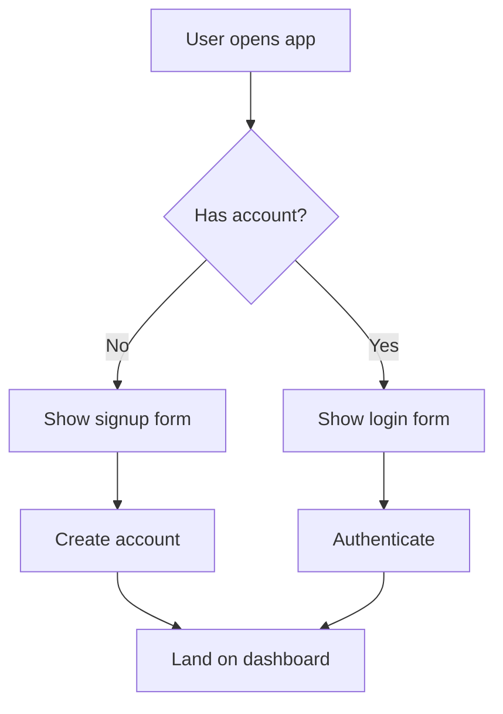
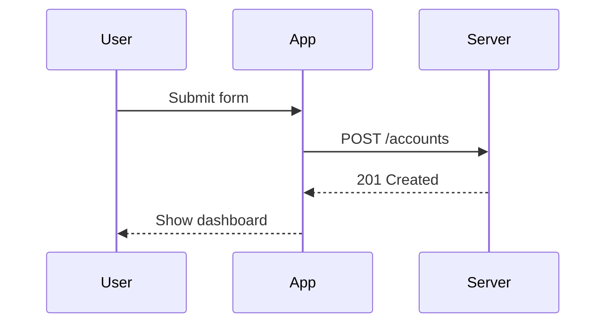

# Mermaid Rendering Test

This file exists to manually exercise Mermaid diagram rendering inside Semantic Zoom. It mixes ordinary prose, a plain fenced code block, and two Mermaid diagrams so you can confirm that both code blocks and diagrams behave the same way across zoom levels: fully rendered at Level 0, replaced by plain-language summary text at Level −1 and Level −2.

## Onboarding Flow

The diagram below sketches the account setup flow for a new user. At Level 0 it should render as a live, pannable Mermaid flowchart. At Level −1 and Level −2 you should see only the section's summary sentence — the diagram itself must not be visible or interactive at those levels, exactly like a code block is not visible at those levels.



That flow is deliberately small — four decision paths — so it's easy to eyeball whether pan/zoom and node click wiring behave correctly without a large diagram getting in the way.

## Retry Logic Reference

Here is a plain code block, included so you can compare its collapse behavior against the Mermaid block above. Both should be hidden the same way once you zoom out past Level 0.

```javascript
async function fetchWithRetry(url, attempts = 3) {
  for (let i = 0; i < attempts; i++) {
    try {
      return await fetch(url);
    } catch (err) {
      if (i === attempts - 1) throw err;
      await new Promise((r) => setTimeout(r, 200 * (i + 1)));
    }
  }
}
```

The retry helper above waits longer between each failed attempt, which is a common pattern for network calls that might fail transiently rather than permanently.

## Request Sequence

This second Mermaid diagram is a sequence diagram rather than a flowchart. It is included on purpose: the app's source-text graph parser only understands the flowchart subset of Mermaid syntax, so this diagram should still render as a live SVG, but node-click selection against a parsed graph is expected to be a no-op here since sequence diagrams fall outside that parser's coverage.



If both diagrams above render correctly at Level 0 and both collapse to summary text at Level −1 and Level −2, the feature is behaving consistently with how code blocks already work in this app.

<!-- semantic-zoom:payload:v1
{"version":1,"docHash":"3391636f32eae0729afbb55968e669638e059cf999a2ca59884e815be3674d3a","meta":{"M1":{"id":"M1","level":-2,"title":"Mermaid Diagram Test","body":"This whole file is a hand-built check for Mermaid rendering: two diagrams and one plain code block, so you can confirm diagrams disappear at the same zoom levels code blocks already do, and reappear correctly when you zoom back in.","children":["S-ae99cfc6-0","S-966c7530-0","S-0816b274-0"]}},"sections":{"S-ae99cfc6-0":{"id":"S-ae99cfc6-0","level":-1,"parent":"M1","children":["P-ae99cfc6-0","P-3835171c-0","P-6c3df1bd-0","P-51edd243-0","P-3cd0d63e-0","P-dd5f7aae-0"],"title":"Onboarding Flow","body":"Walks through what a new user sees when they open the app for the first time, illustrated as a flowchart."},"S-966c7530-0":{"id":"S-966c7530-0","level":-1,"parent":"M1","children":["P-966c7530-0","P-ea8eb0cb-0","P-8f67630c-0","P-d827f787-0"],"title":"Retry Logic Reference","body":"A small code sample showing how the app retries a failed network call, used here as the control case to compare against the diagrams."},"S-0816b274-0":{"id":"S-0816b274-0","level":-1,"parent":"M1","children":["P-0816b274-0","P-aa9f09c0-0","P-bab73207-0","P-d8435a5b-0"],"title":"Request Sequence","body":"Shows the back-and-forth between the app and the server as a sequence diagram, a diagram shape the graph parser doesn't fully understand yet."}},"paragraphs":{"P-ae99cfc6-0":{"id":"P-ae99cfc6-0","level":0,"parent":"S-ae99cfc6-0","kind":"heading","span":{"start":0,"end":24},"html":"<h1>Mermaid Rendering Test</h1>"},"P-3835171c-0":{"id":"P-3835171c-0","level":0,"parent":"S-ae99cfc6-0","kind":"prose","span":{"start":26,"end":379},"html":"<p>This file exists to manually exercise Mermaid diagram rendering inside Semantic Zoom. It mixes ordinary prose, a plain fenced code block, and two Mermaid diagrams so you can confirm that both code blocks and diagrams behave the same way across zoom levels: fully rendered at Level 0, replaced by plain-language summary text at Level −1 and Level −2.</p>"},"P-6c3df1bd-0":{"id":"P-6c3df1bd-0","level":0,"parent":"S-ae99cfc6-0","kind":"heading","span":{"start":381,"end":399},"html":"<h2>Onboarding Flow</h2>"},"P-51edd243-0":{"id":"P-51edd243-0","level":0,"parent":"S-ae99cfc6-0","kind":"prose","span":{"start":401,"end":746},"html":"<p>The diagram below sketches the account setup flow for a new user. At Level 0 it should render as a live, pannable Mermaid flowchart. At Level −1 and Level −2 you should see only the section&#39;s summary sentence — the diagram itself must not be visible or interactive at those levels, exactly like a code block is not visible at those levels.</p>"},"P-3cd0d63e-0":{"id":"P-3cd0d63e-0","level":0,"parent":"S-ae99cfc6-0","kind":"code","span":{"start":748,"end":1005},"html":"<pre><code class=\"language-mermaid\">flowchart TD\n    A[User opens app] --&gt; B{Has account?}\n    B -- No --&gt; C[Show signup form]\n    B -- Yes --&gt; D[Show login form]\n    C --&gt; E[Create account]\n    D --&gt; F[Authenticate]\n    E --&gt; G[Land on dashboard]\n    F --&gt; G[Land on dashboard]\n</code></pre>","lang":"mermaid"},"P-dd5f7aae-0":{"id":"P-dd5f7aae-0","level":0,"parent":"S-ae99cfc6-0","kind":"prose","span":{"start":1007,"end":1190},"html":"<p>That flow is deliberately small — four decision paths — so it&#39;s easy to eyeball whether pan/zoom and node click wiring behave correctly without a large diagram getting in the way.</p>"},"P-966c7530-0":{"id":"P-966c7530-0","level":0,"parent":"S-966c7530-0","kind":"heading","span":{"start":1192,"end":1216},"html":"<h2>Retry Logic Reference</h2>"},"P-ea8eb0cb-0":{"id":"P-ea8eb0cb-0","level":0,"parent":"S-966c7530-0","kind":"prose","span":{"start":1218,"end":1395},"html":"<p>Here is a plain code block, included so you can compare its collapse behavior against the Mermaid block above. Both should be hidden the same way once you zoom out past Level 0.</p>"},"P-8f67630c-0":{"id":"P-8f67630c-0","level":0,"parent":"S-966c7530-0","kind":"code","span":{"start":1397,"end":1680},"html":"<pre><code class=\"language-javascript\">async function fetchWithRetry(url, attempts = 3) {\n  for (let i = 0; i &lt; attempts; i++) {\n    try {\n      return await fetch(url);\n    } catch (err) {\n      if (i === attempts - 1) throw err;\n      await new Promise((r) =&gt; setTimeout(r, 200 * (i + 1)));\n    }\n  }\n}\n</code></pre>","lang":"javascript"},"P-d827f787-0":{"id":"P-d827f787-0","level":0,"parent":"S-966c7530-0","kind":"prose","span":{"start":1682,"end":1843},"html":"<p>The retry helper above waits longer between each failed attempt, which is a common pattern for network calls that might fail transiently rather than permanently.</p>"},"P-0816b274-0":{"id":"P-0816b274-0","level":0,"parent":"S-0816b274-0","kind":"heading","span":{"start":1845,"end":1864},"html":"<h2>Request Sequence</h2>"},"P-aa9f09c0-0":{"id":"P-aa9f09c0-0","level":0,"parent":"S-0816b274-0","kind":"prose","span":{"start":1866,"end":2250},"html":"<p>This second Mermaid diagram is a sequence diagram rather than a flowchart. It is included on purpose: the app&#39;s source-text graph parser only understands the flowchart subset of Mermaid syntax, so this diagram should still render as a live SVG, but node-click selection against a parsed graph is expected to be a no-op here since sequence diagrams fall outside that parser&#39;s coverage.</p>"},"P-bab73207-0":{"id":"P-bab73207-0","level":0,"parent":"S-0816b274-0","kind":"code","span":{"start":2252,"end":2461},"html":"<pre><code class=\"language-mermaid\">sequenceDiagram\n    participant U as User\n    participant A as App\n    participant S as Server\n    U-&gt;&gt;A: Submit form\n    A-&gt;&gt;S: POST /accounts\n    S--&gt;&gt;A: 201 Created\n    A--&gt;&gt;U: Show dashboard\n</code></pre>","lang":"mermaid"},"P-d8435a5b-0":{"id":"P-d8435a5b-0","level":0,"parent":"S-0816b274-0","kind":"prose","span":{"start":2463,"end":2661},"html":"<p>If both diagrams above render correctly at Level 0 and both collapse to summary text at Level −1 and Level −2, the feature is behaving consistently with how code blocks already work in this app.</p>"}},"order":{"meta":["M1"],"sections":["S-ae99cfc6-0","S-966c7530-0","S-0816b274-0"],"paragraphs":["P-ae99cfc6-0","P-3835171c-0","P-6c3df1bd-0","P-51edd243-0","P-3cd0d63e-0","P-dd5f7aae-0","P-966c7530-0","P-ea8eb0cb-0","P-8f67630c-0","P-d827f787-0","P-0816b274-0","P-aa9f09c0-0","P-bab73207-0","P-d8435a5b-0"]}}
-->
